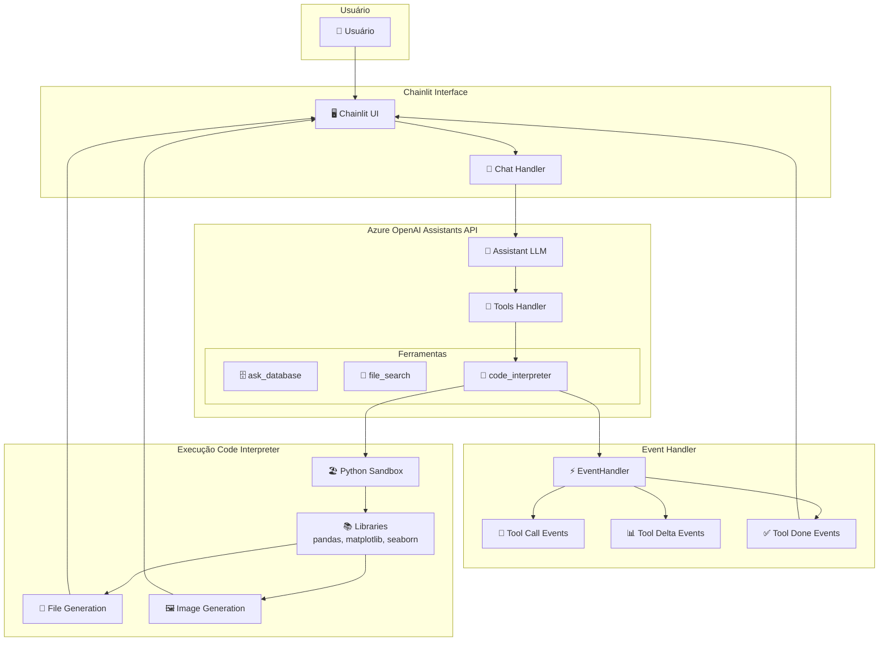
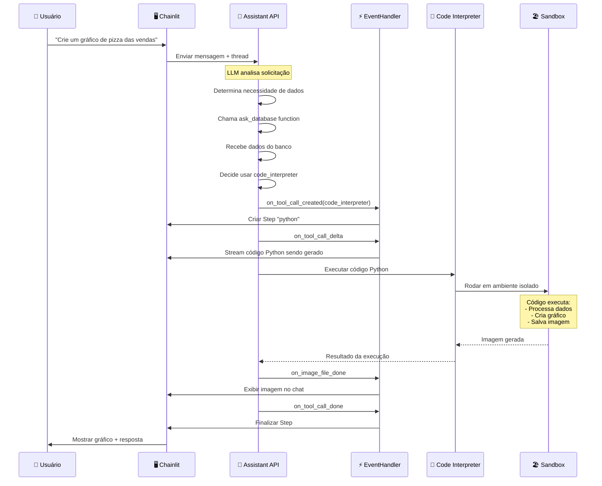
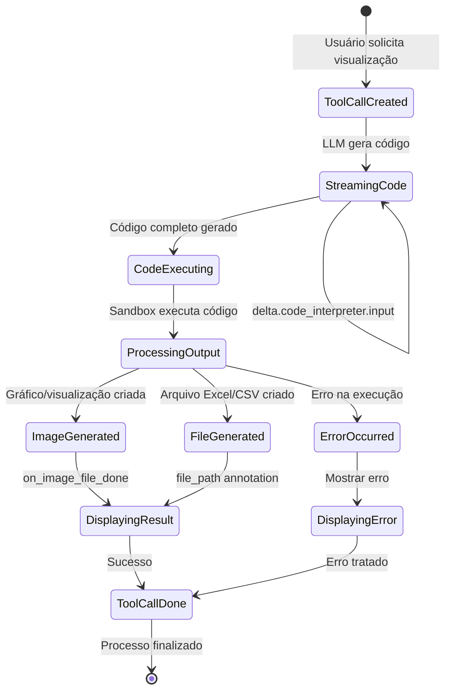
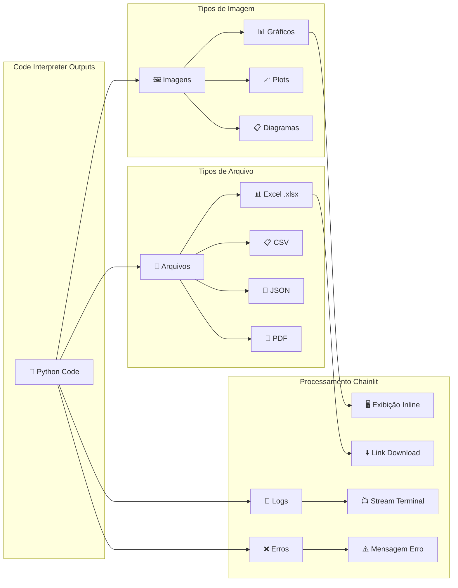
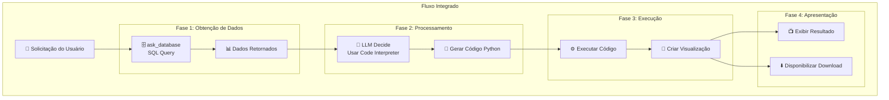

# Code Interpreter - Diagramas e Fluxos Técnicos

## Arquitetura do Code Interpreter



## Fluxo de Execução Detalhado



## Estados e Eventos do Code Interpreter



## Tipos de Saída do Code Interpreter



## Integração com Outras Ferramentas



## Event Handler - Métodos Específicos

```python
# Principais métodos para Code Interpreter no EventHandler

class EventHandler(AsyncAssistantEventHandler):
    
    async def on_tool_call_created(self, tool_call):
        """Quando code_interpreter é iniciado"""
        if tool_call.type == "code_interpreter":
            # Criar step visual no Chainlit
            self.current_step = cl.Step(name="code_interpreter", type="tool")
            self.current_step.language = "python"
    
    async def on_tool_call_delta(self, delta, snapshot):
        """Durante execução do código (streaming)"""
        if delta.type == "code_interpreter":
            if delta.code_interpreter.input:
                # Mostrar código sendo executado
                await self.current_step.stream_token(delta.code_interpreter.input)
    
    async def on_image_file_done(self, image_file):
        """Quando imagem é gerada"""
        # Fazer download da imagem
        # Criar elemento visual
        # Limpar arquivo temporário
    
    async def on_tool_call_done(self, tool_call):
        """Quando code_interpreter termina"""
        if tool_call.type == "code_interpreter":
            # Finalizar step visual
            self.current_step.end = utc_now()
            await self.current_step.update()
```

## Bibliotecas Python Disponíveis

O ambiente sandbox do Code Interpreter inclui:

- **Análise de Dados**: pandas, numpy
- **Visualização**: matplotlib, seaborn, plotly
- **Arquivos**: openpyxl, xlsxwriter
- **Utilidades**: datetime, json, os, sys
- **Matemática**: scipy, statsmodels (limitado)

## Configurações e Limitações

### Configurações no app.py
```python
MAX_COMPLETION_TOKENS = 4096    # Máximo tokens na resposta
MAX_PROMPT_TOKENS = 10240       # Máximo tokens no prompt
temperature=0.2                 # Controle de criatividade
```

### Limitações Importantes
1. **Tempo de execução**: ~60 segundos máximo
2. **Memória**: Limitada pelo ambiente sandbox
3. **Persistência**: Arquivos não persistem entre execuções
4. **Internet**: Sem acesso à internet no sandbox
5. **Bibliotecas**: Apenas bibliotecas pré-instaladas